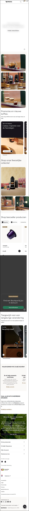
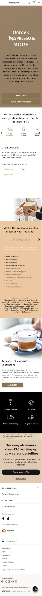
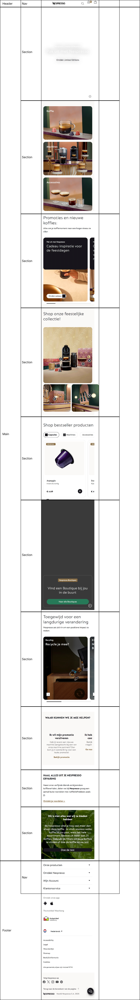
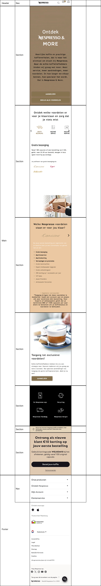
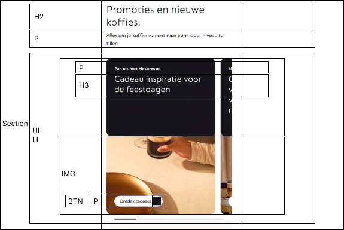
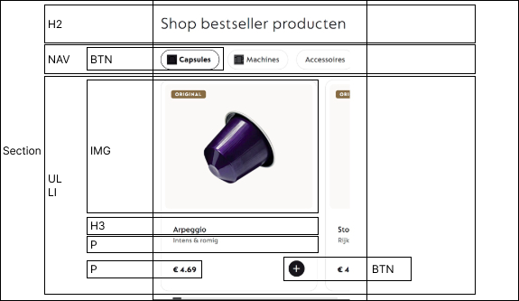
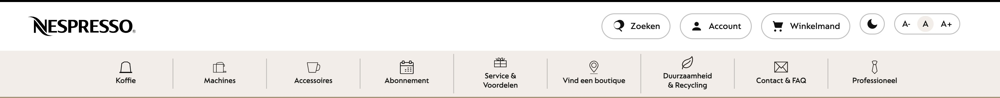
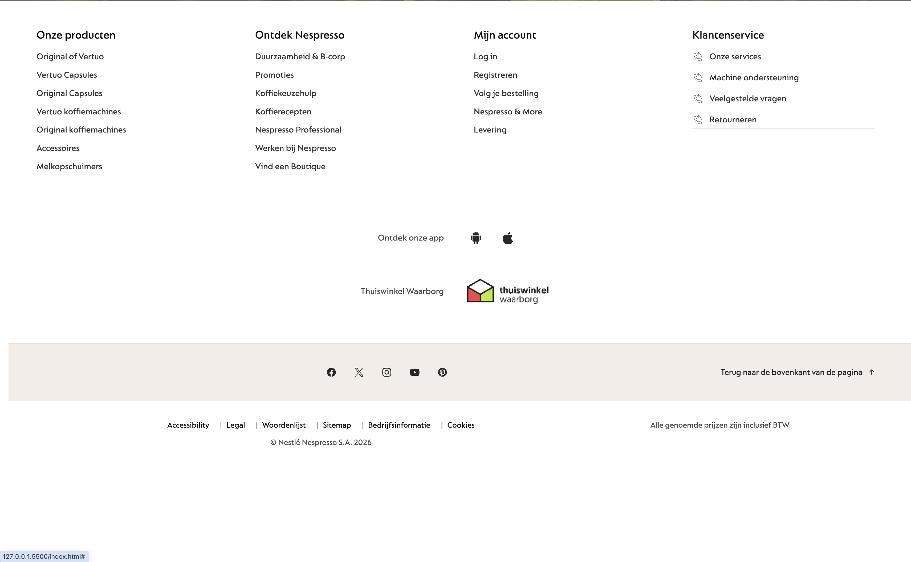

# Procesverslag
Markdown is een simpele manier om HTML te schrijven.  
Markdown cheat cheet: [Hulp bij het schrijven van Markdown](https://github.com/adam-p/markdown-here/wiki/Markdown-Cheatsheet).

Nb. De standaardstructuur en de spartaanse opmaak van de README.md zijn helemaal prima. Het gaat om de inhoud van je procesverslag. Besteedt de tijd voor pracht en praal aan je website.

Nb. Door *open* toe te voegen aan een *details* element kun je deze standaard open zetten. Fijn om dat steeds voor de relevante stuk(ken) te doen.

## Jij

  
uitwerken voor kick-off werkgroep

  ### Auteur:
 Joy Laros

  #### Je startniveau:
Blauw

  #### Je focus:
Surface plane
 

## Je website

  
uitwerken voor kick-off werkgroep

  ### Je opdracht:
Nespresso

  #### Screenshot(s) van de eerste pagina (small screen): 
  Nespresso Home  
  

  #### Screenshot(s) van de tweede pagina (small screen):
  Nespresso & More  
  
 

## Toegankelijkheidstest 1/2 (week 1)

  
Uitwerken na test in 2e werkgroep

  ### Bevindingen
Fysieke toegankelijkheidstest:
Spasmes/Parkinson:
Zolang het kleine schokken zijn is het allemaal goed te doen, maar zodra het hardere schokken zijn zijn de kleine vakjes moeilijk klikbaar. De kleine vakjes zijn dan te klein om op te ‘richten’ bij hardere schokken.

Slechte motoriek:
Met een slechte motoriek is de website goed toegankelijk. Het scrollen en klikken gaat beide gemakkelijk.

Slechtziend:
De grotere en dikkere letters zijn prima te lezen. De kleine, dunnere letters zijn slecht te lezen. De kleine letters op afbeeldingen zijn niet te lezen.

WCAG toegankelijkheidstest:
- Menubalk wordt soms overgeslagen
- Segment hebben allemaal zelfde naam
- Segment gebruiken kan niet
- Links worden dubbel voorgelezen
- & wordt niet voorgelezen
- Nespresso & More wordt deel na carroussel overgeslagen

## Breakdownschets (week 1)

  
uitwerken na afloop 3e werkgroep

  ### De hele pagina: 
  

   ### De tweede hele pagina: 
  

  ### Dynamisch deel: 
  

  ### Tweede dynamische deel: 
  

  ### Derde dynamische deel: 
  

## Voortgang 1 (week 2)

  
uitwerken voor 1e voortgang

  ### Stand van zaken
  Ik vond het beginnen van mijn website lastig, het was echt weer even inkomen. Nu de basis voor mijn html staat, ben ik gemotiveerd om er een mooie website van te gaan maken?

  ### Agenda voor meeting

  | Joy      | Dirk         | Maks   |
  | Wat was ook alweer de sneltoets om code netjes te laten inspringen?| Mogen bepaalde dingen verbeterd worden of eigen invulling krijgen. Bijvoorbeeld een echt hamburgermenu ipv. een paginavullend menu? | ---          | 
  | Ga ik de goede kant op met mijn HTML?  | Is mijn website goed genoeg voor dit vak, niet te simpel?  | Doornemen breakdown van mijn breakdownschetsen. Kijken of ze goed zijn.  |

  ### Verslag van meeting
 
Geen classes
Section altijd heading
Button -> als iets op dezelfde pagina blijft
Link -> wanneer je naar andere pagina gaat

H1 is titel van pagina 
Op de main pagina mag je h1 maken van je logo als het gekke h1 is

Nespresso als m’n H1 doen, niet ‘It’s Gifting Friday!’

Koffie, machines en accessoires -> articles

## Voortgang 2 (week 3)

  
uitwerken voor 2e voortgang

  ### Stand van zaken
Ik ben weer ingekomen en ben goed op weg met mijn html. Wel vroeg ik mij af hoe ik de elementen allemaal op de juiste manier moest gaan aanroepen in mijn css.

  ### Verslag van meeting
Ik heb opnieuw gevraagd of ik goed op weg was met mijn codes en het antwoord hierop was; ja. Ik heb kunnen vragen hoe ik op de juiste manier de elementen moest aanroepen in mijn css. Het antwoord was dat ik meerdere css bestanden moest gaan gebruiken, dus daar ging ik mee aan de slag!

## Toegankelijkheidstest 2/2 (week 4)

  
uitwerken na test in 9e werkgroep

  ### Bevindingen
- Gebruik van semantische HTML (header, nav, main, section, article, juiste headings) voor een duidelijke structuur voor screenreaders.
- Alle icon-only knoppen hebben duidelijke aria-labels (bijv. menu, zoeken, winkelmand).
- Interactieve onderdelen geven hun status door met aria-expanded en aria-pressed.
- Afbeeldingen hebben betekenisvolle alt-teksten; decoratieve beelden hebben alt="" en aria-hidden="true".
- Correct gebruik van <button> en <a>, zodat toetsenbordbediening vanzelf goed werkt.
- Toevoeging van tekstgrootte-instellingen en een licht/donker-modus voor gebruikers met visuele beperkingen.
- Mobile-first en flex/grid zorgen dat de pagina ook bij inzoomen en op kleine schermen goed leesbaar blijft.

## Voortgang 3 (week 4)

  
uitwerken voor 3e voortgang

  ### Stand van zaken
Op dit moment had ik geen specifieke vragen, dus heb ik ervoor gekozen om deze tijd te gebruiken om verder te werken aan mijn eigen website.

## Eindgesprek (week 5)

  
uitwerken voor eindgesprek

  ### Je uitkomst - karakteristiek screenshots:
  

  ### Dit ging goed/Heb ik geleerd: 
Ik ben trots op het eindresultaat van mijn twee pagina’s. Omdat ik coderen vaak moeilijk en soms ook frustrerend vind, vind ik dat ik trots mag zijn op wat ik heb neergezet. Het onderdeel dat naar mijn mening het beste is gelukt, is de header van de pagina. In het begin keek ik hier erg tegenop, maar met behulp van goede bronnen en de oefeningen uit de les is het uiteindelijk goed gelukt. Daarnaast ben ik ook tevreden over de surface-plane-elementen die ik in de header heb toegevoegd; deze passen goed bij de uitstraling van de pagina en sluiten aan bij de stijl van Nespresso.

  

  ### Dit was lastig/Is niet gelukt:
Ondanks veel moeite en uren sleutelen is het mij helaas niet gelukt om de footer van index.html anders te maken dan die van de tweede pagina. Dit vind ik jammer, omdat ik hier graag meer verschil in had willen aanbrengen. Als ik meer tijd had gehad, had ik daarnaast nog enkele kleine aanpassingen gedaan om de algehele lay-out van de pagina’s verder te verfijnen. Denk hierbij aan het consistenter maken van buttons, kleuren en afstanden, zodat alles nog beter op elkaar zou aansluiten.

  

## Bronnenlijst

  
continu bijhouden terwijl je werkt

- MDN: https://developer.mozilla.org/en-US/docs/Web/HTML/Reference/Elements/header
- MDN : https://developer.mozilla.org/en-US/docs/Web/HTML/Reference/Elements/nav
- MDN aria-label: https://developer.mozilla.org/en-US/docs/Web/Accessibility/ARIA/Reference/Attributes/aria-label
- MDN aria-expanded: https://developer.mozilla.org/en-US/docs/Web/Accessibility/ARIA/Reference/Attributes/aria-expanded
- WAI-ARIA APG Disclosure Navigation: https://www.w3.org/WAI/ARIA/apg/patterns/disclosure/examples/disclosure-navigation/
- WAI-ARIA APG Button (aria-pressed toggle): https://www.w3.org/WAI/ARIA/apg/patterns/button/
- MDN aria-live: https://developer.mozilla.org/en-US/docs/Web/Accessibility/ARIA/Reference/Attributes/aria-live
- MDN aria-atomic: https://developer.mozilla.org/en-US/docs/Web/Accessibility/ARIA/Reference/Attributes/aria-atomic
- MDN aria-hidden: https://developer.mozilla.org/en-US/docs/Web/Accessibility/ARIA/Reference/Attributes/aria-hidden
- MDN : https://developer.mozilla.org/en-US/docs/Web/HTML/Reference/Elements/section
- MDN headings: https://developer.mozilla.org/en-US/docs/Web/HTML/Reference/Elements/Heading_Elements
- WAI-ARIA APG Carousel pattern: https://www.w3.org/WAI/ARIA/apg/patterns/carousel/
- Chrome for Developers (accessible carousel): https://developer.chrome.com/blog/accessible-carousel
- W3C WAI Images tutorial: https://www.w3.org/WAI/tutorials/images/
- W3C WAI Informative images: https://www.w3.org/WAI/tutorials/images/informative/
- MDN : https://developer.mozilla.org/en-US/docs/Web/HTML/Element/video
- web.dev autoplay video best practices: https://web.dev/autoplay/
- W3C WCAG – Animation & motion: https://www.w3.org/WAI/WCAG21/Understanding/animation-from-interactions.html
- WHATWG : https://html.spec.whatwg.org/multipage/sections.html#the-footer-element
- MDN HTML elements reference (footer): https://developer.mozilla.org/en-US/docs/Web/HTML/Reference/Elements
- MDN : https://developer.mozilla.org/en-US/docs/Web/HTML/Reference/Elements/details
- MDN: https://developer.mozilla.org/en-US/docs/Web/HTML/Reference/Elements/summary
- WAI-ARIA APG Disclosure pattern: https://www.w3.org/WAI/ARIA/apg/patterns/ (Disclosure)
- MDN Accessible name (aria-label): https://developer.mozilla.org/en-US/docs/Glossary/Accessible_name
- WCAG technique ARIA14 (aria-label): https://www.w3.org/WAI/WCAG21/Techniques/aria/ARIA14
- WAI-ARIA APG Carousel pattern: https://www.w3.org/WAI/ARIA/apg/patterns/carousel/
- MDN aria-label: https://developer.mozilla.org/en-US/docs/Web/Accessibility/ARIA/Reference/Attributes/aria-label
- WCAG Technique ARIA14 (aria-label): https://www.w3.org/WAI/WCAG21/Techniques/aria/ARIA14
- MDN aria-hidden: https://developer.mozilla.org/en-US/docs/Web/Accessibility/ARIA/Reference/Attributes/aria-hidden
- W3C WAI Images tutorial: https://www.w3.org/WAI/tutorials/images/
- W3C WAI Informative images: https://www.w3.org/WAI/tutorials/images/informative/
- W3C WAI Alt decision tree: https://www.w3.org/WAI/tutorials/images/decision-tree/
- WAI-ARIA APG Carousel pattern: https://www.w3.org/WAI/ARIA/apg/patterns/carousel/
- WAI-ARIA carousel example: https://www.w3.org/TR/2019/NOTE-wai-aria-practices-1.1-20190207/examples/carousel/carousel-1/carousel-1.html
- WAI-ARIA APG Tabs pattern (optioneel bij tabbed carousel/indicators): https://www.w3.org/WAI/ARIA/apg/patterns/tabs/
- Smashing Magazine (grouped vs tabbed carousel): https://www.smashingmagazine.com/2023/02/guide-building-accessible-carousels/
- MDN aria-label: https://developer.mozilla.org/en-US/docs/Web/Accessibility/ARIA/Reference/Attributes/aria-label
- MDN article role (semantiek van “losstaand item”): https://developer.mozilla.org/en-US/docs/Web/Accessibility/ARIA/Reference/Roles/article_role
- MDN HTML elements reference: https://developer.mozilla.org/en-US/docs/Web/HTML/Reference/Elements
- MDN querySelector: https://developer.mozilla.org/en-US/docs/Web/API/Document/querySelector
- MDN addEventListener: https://developer.mozilla.org/en-US/docs/Web/API/EventTarget/addEventListener
- MDN aria-expanded: https://developer.mozilla.org/en-US/docs/Web/Accessibility/ARIA/Reference/Attributes/aria-expanded
- WAI-ARIA APG Disclosure/Menu Button: https://www.w3.org/WAI/ARIA/apg/patterns/disclosure/
- MDN keydown event: https://developer.mozilla.org/en-US/docs/Web/API/Document/keydown_event
- MDN scrollBy(): https://developer.mozilla.org/en-US/docs/Web/API/Element/scrollBy
- MDN addEventListener: https://developer.mozilla.org/en-US/docs/Web/API/EventTarget/addEventListener
- WAI-ARIA APG Carousel pattern: https://www.w3.org/WAI/ARIA/apg/patterns/carousel/
- web.dev Horizontal scrolling: https://web.dev/patterns/layout/horizontal-scrolling/
- MDN scrollBy(): https://developer.mozilla.org/en-US/docs/Web/API/Element/scrollBy
- MDN addEventListener: https://developer.mozilla.org/en-US/docs/Web/API/EventTarget/addEventListener
- WAI-ARIA APG Carousel pattern: https://www.w3.org/WAI/ARIA/apg/patterns/carousel/
- web.dev Horizontal scrolling: https://web.dev/patterns/layout/horizontal-scrolling/
- MDN querySelectorAll: https://developer.mozilla.org/en-US/docs/Web/API/Document/querySelectorAll
- MDN scrollLeft: https://developer.mozilla.org/en-US/docs/Web/API/Element/scrollLeft
- MDN getComputedStyle: https://developer.mozilla.org/en-US/docs/Web/API/Window/getComputedStyle
- MDN cloneNode: https://developer.mozilla.org/en-US/docs/Web/API/Node/cloneNode
- MDN requestAnimationFrame: https://developer.mozilla.org/en-US/docs/Web/API/window/requestAnimationFrame
- WAI-ARIA APG Carousel pattern: https://www.w3.org/WAI/ARIA/apg/patterns/carousel/
- MDN closest(): https://developer.mozilla.org/en-US/docs/Web/API/Element/closest
- MDN dataset: https://developer.mozilla.org/en-US/docs/Web/API/HTMLElement/dataset
- MDN classList: https://developer.mozilla.org/en-US/docs/Web/API/Element/classList
- MDN NodeList.forEach(): https://developer.mozilla.org/en-US/docs/Web/API/NodeList/forEach
- MDN matchMedia(): https://developer.mozilla.org/en-US/docs/Web/API/Window/matchMedia
- MDN resize event: https://developer.mozilla.org/en-US/docs/Web/API/Window/resize_event
- MDN localStorage: https://developer.mozilla.org/en-US/docs/Web/API/Window/localStorage
- MDN querySelectorAll: https://developer.mozilla.org/en-US/docs/Web/API/Document/querySelectorAll
- MDN dataset (data-*): https://developer.mozilla.org/en-US/docs/Web/API/HTMLElement/dataset
- MDN localStorage: https://developer.mozilla.org/en-US/docs/Web/API/Window/localStorage
- WAI-ARIA APG Button pattern (toggle): https://www.w3.org/WAI/ARIA/apg/patterns/button/
- MDN querySelector: https://developer.mozilla.org/en-US/docs/Web/API/Document/querySelector
- MDN classList: https://developer.mozilla.org/en-US/docs/Web/API/Element/classList
- MDN DOMContentLoaded: https://developer.mozilla.org/en-US/docs/Web/API/Document/DOMContentLoaded_event
- MDN requestAnimationFrame: https://developer.mozilla.org/en-US/docs/Web/API/window/requestAnimationFrame
- MDN matchMedia(): https://developer.mozilla.org/en-US/docs/Web/API/Window/matchMedia
- MDN prefers-reduced-motion: https://developer.mozilla.org/en-US/docs/Web/CSS/@media/prefers-reduced-motion
- MDN classList: https://developer.mozilla.org/en-US/docs/Web/API/Element/classList
- MDN wheel event: https://developer.mozilla.org/en-US/docs/Web/API/Element/wheel_event
- web.dev Reduced motion: https://web.dev/prefers-reduced-motion/
- MDN querySelectorAll: https://developer.mozilla.org/en-US/docs/Web/API/Document/querySelectorAll
- MDN localStorage: https://developer.mozilla.org/en-US/docs/Web/API/Window/localStorage
- MDN textContent: https://developer.mozilla.org/en-US/docs/Web/API/Node/textContent
- W3C Accessible Name: https://www.w3.org/TR/accname-1.2/

